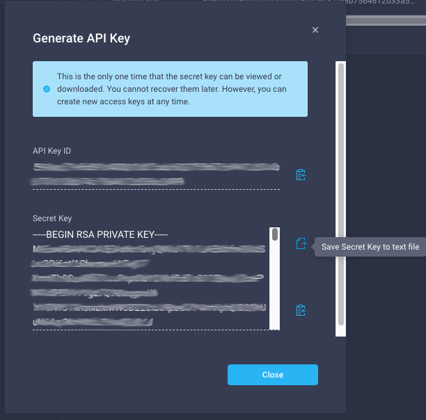

## Generate API key and Secret Key and import modules

Log into your Intersight account and navigate to **Settings** which is available by clicking the gear icon located towaward the upper-righthand side of the Intersight user interface.

* Click **API Keys** located in the lefthand column.
* Click **Generate API Key** located toward the upper-righthand side of the page.
* Select **API key for OpenAPI schema version 2** in the **Generate API Key** dialog box and provide a description for your API key.
* Copy the API Key ID and store it somewhere for use in the upcoming steps.
* Save the **Secret Key** to a text file and make note of its location. Move the file to the same directory where this code is running or make note of its location for use in the upcoming steps.

> This is the only one time that the secret key can be viewed or downloaded. You cannot recover them later. However, you can create new access keys at any time.

**Next Step: Install the Intersight Python SDK and import modules**